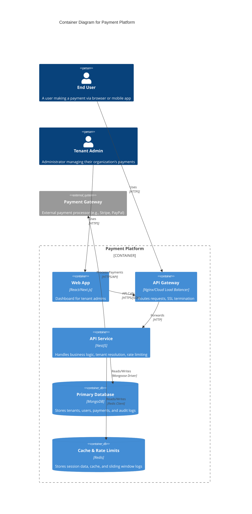
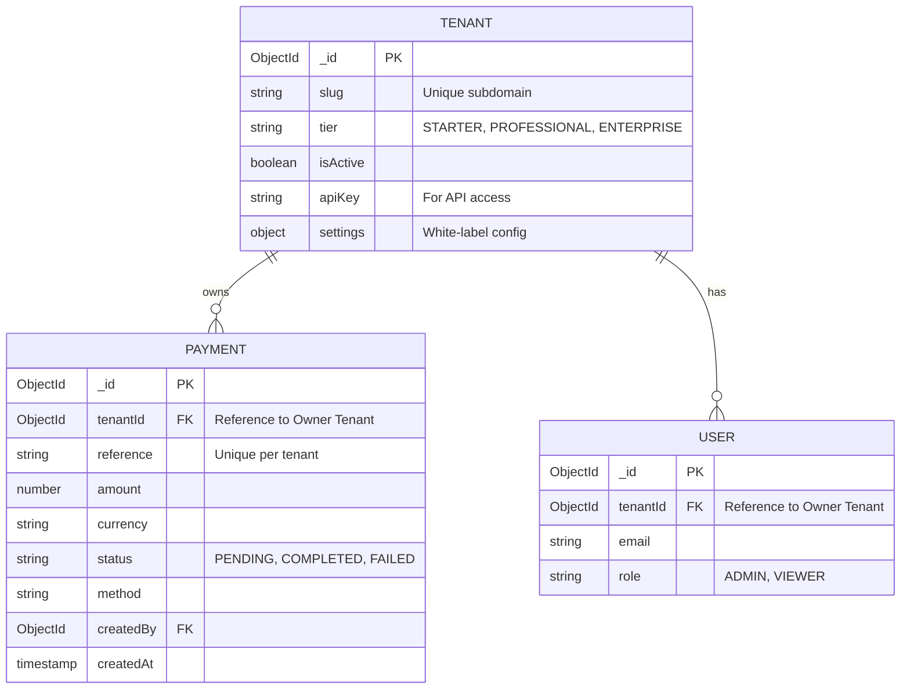
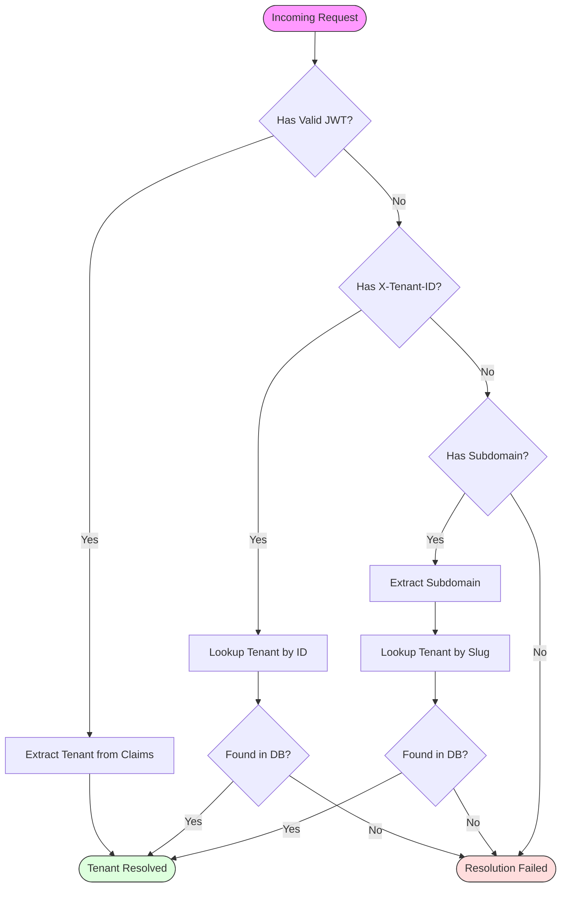
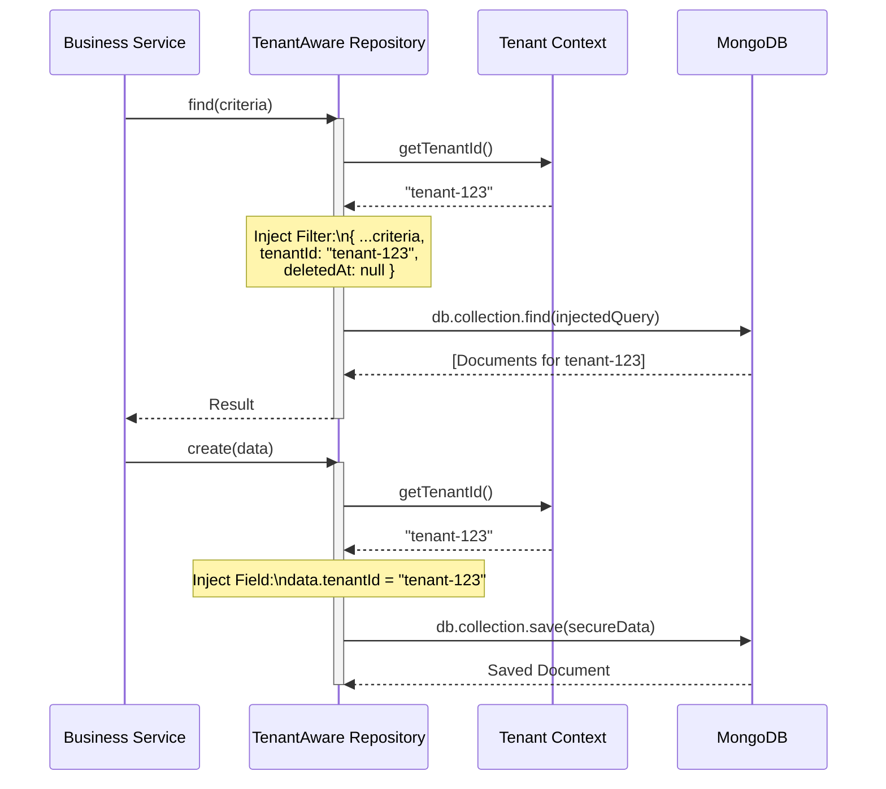

# Multi-Tenant Payment Platform - Interview Preparation Guide

> **Complete Analysis of Implementation with Code References, Explanations, and Interview Questions**

---

## Table of Contents

1. [Project Overview](#project-overview)
2. [System Architecture](#system-architecture)
3. [Task A: Tenant Context & Resolution](#task-a-tenant-context--resolution)
4. [Task B: Data Isolation Layer](#task-b-data-isolation-layer)
5. [Task C: Rate Limiting & Usage Tracking](#task-c-rate-limiting--usage-tracking)
6. [Architecture Discussion Points](#architecture-discussion-points)
7. [Real-World Scenarios](#real-world-scenarios)

---

## Project Overview

### Problem Statement

Design and implement core components of a **multi-tenant payment platform** serving multiple financial institutions with:

- Complete data isolation
- Customizable payment workflows
- White-label capabilities
- Resource limits and usage tracking

### Tech Stack

| Layer        | Technology                |
| ------------ | ------------------------- |
| Backend      | NestJS 10, TypeScript     |
| Database     | MongoDB with Mongoose ODM |
| Cache/Queue  | Redis                     |
| Architecture | Nx Monorepo               |

### Tenant Tiers

| Tier         | Max Users | Transactions/Month | API Rate Limit | Features                                    |
| ------------ | --------- | ------------------ | -------------- | ------------------------------------------- |
| Starter      | 10        | 1,000              | 60/min         | Basic payments                              |
| Professional | 100       | 50,000             | 300/min        | + Bulk payments, Analytics                  |
| Starter      | 10        | 1,000              | 60/min         | Basic payments                              |
| Professional | 100       | 50,000             | 300/min        | + Bulk payments, Analytics                  |
| Enterprise   | Unlimited | Unlimited          | 1000/min       | + Custom workflows, White-label, API access |

---

## System Architecture

### High-Level Architecture (C4 Container Style)



### Data Schema (ER Diagram)

The following diagram illustrates the relationship between the core entities and how tenant isolation is enforced at the schema level.



### Architecture Walkthrough

### Architecture Walkthrough

The system follows a **Multi-Tenant Monolithic** architecture optimized for data isolation and performance.

1.  **Request Entry**: All requests (Web, API, Webhooks) enter through the main application entry point.
2.  **Tenant Resolution (Layer 1)**: Before reaching any business logic, the `TenantMiddleware` intercepts the request. It uses the `TenantResolverService` to identify the tenant based on the strategy priority (JWT > Header > Subdomain).
3.  **Context Establishment**: Once resolved, the tenant information is stored in `AsyncLocalStorage`. This creates a request-scoped context that is accessible anywhere in the application without passing parameters.
4.  **Guard Protection (Layer 2)**:
    - **RateLimitGuard**: Checks Redis to ensure the tenant hasn't exceeded their tier limits.
    - **TenantGuard**: Ensures a valid tenant context exists before allowing access to protected routes.
5.  **Business Logic**: Controllers and Services execute business logic. They don't need to worry about `tenantId` handling.
6.  **Data Access (Layer 3)**: The `TenantAwareRepository` automatically injects the `tenantId` from the context into every database query and write operation, ensuring strict data isolation.

---

## Task A: Tenant Context & Resolution

### Problem Statement

Build a system to identify which tenant a request is coming from using multiple strategies, store that information for the request duration, and integrate it into the NestJS request lifecycle.

---

### Sub-Task A.1: Multi-Strategy Tenant Resolution

#### Approach

Implement a priority-based resolution system with 4 strategies:



1. **JWT Claims** (highest priority) - Cryptographically signed, most trusted
2. **X-Tenant-ID Header** - For API integrations
3. **Subdomain** - For web access (bank1.financeops.com)
4. **Custom Domain** - For white-label clients

#### Implementation

**File:** [tenant-resolver.service.ts](file:///Users/apple/Desktop/dev/Intv/payment-platform/apps/api/src/tenants/tenant-resolver.service.ts)

```typescript
/**
 * Resolution Priority (highest to lowest):
 * 1. JWT Claims - Most trusted (authenticated user)
 * 2. X-Tenant-ID Header - For API integrations
 * 3. Subdomain - For web access (bank1.financeops.com)
 * 4. Custom Domain - For white-label domains
 */
async resolve(request: Request): Promise<ResolutionResult | null> {
  // 1. Try JWT claims first (highest priority)
  const jwtTenant = await this.resolveFromJwt(request);
  if (jwtTenant) {
    return { tenant: jwtTenant, resolvedVia: 'jwt' };
  }

  // 2. Try X-Tenant-ID header
  const headerTenant = await this.resolveFromHeader(request);
  if (headerTenant) {
    return { tenant: headerTenant, resolvedVia: 'header' };
  }

  // 3. Try subdomain extraction
  const subdomainTenant = await this.resolveFromSubdomain(request);
  if (subdomainTenant) {
    return { tenant: subdomainTenant, resolvedVia: 'subdomain' };
  }

  // 4. Try custom domain lookup
  const domainTenant = await this.resolveFromCustomDomain(request);
  if (domainTenant) {
    return { tenant: domainTenant, resolvedVia: 'domain' };
  }

  return null;
}
```

**Subdomain Extraction with Edge Case Handling:**

```typescript
private async resolveFromSubdomain(request: Request): Promise<Tenant | null> {
  const host = request.headers.host;
  if (!host) return null;

  // Remove port number if present (e.g., localhost:3000)
  const hostname = host.split(':')[0];

  // Extract subdomain part
  const baseDomain = config.tenant.baseDomain; // 'financeops.com'
  if (!hostname.endsWith(baseDomain)) {
    return null; // Not our main domain
  }

  // Get subdomain: bank1.financeops.com -> bank1
  // Also handles: www.bank1.financeops.com -> bank1
  const subdomainPart = hostname.slice(0, -(baseDomain.length + 1));
  const subdomain = subdomainPart
    .split('.')
    .filter((part) => part !== 'www')
    .pop(); // Get last part closest to base domain

  if (!subdomain) return null;
  return this.findTenantBySlug(subdomain);
}
```

#### Explanation

**Like I'm 5:**
Imagine you have a big hotel with many companies staying in different rooms. When someone comes to the front desk, we need to figure out which company (tenant) they belong to. We check their ID card first (JWT), then ask them (header), then look at their room key card (subdomain), or check our guest book (custom domain).

**Technical Perspective:**
The resolver implements the **Strategy Pattern** with a priority chain. Each resolution method is a fallback to the next, ensuring maximum flexibility for different client types:

- Mobile apps → JWT
- Server-to-server → X-Tenant-ID header
- Browser access → Subdomain
- Enterprise white-label → Custom domain

The priority ensures that if multiple identifiers are present, we use the most trusted one (JWT > header > subdomain > domain).

#### Potential Interview Questions

**From Assignment:**

1. **How do you handle `www.` prefix or port numbers in subdomain extraction?**
   - Port is stripped using `host.split(':')[0]`
   - www is filtered using `.filter((part) => part !== 'www')`

2. **What caching strategy makes sense for tenant lookups?**
   - Redis cache with 5-minute TTL
   - Cache invalidated on tenant updates
   - Multiple cache keys per tenant (id, slug, apiKey, domains)

**General Questions:**

1. Why JWT is highest priority over header?
2. What if a malicious client sends both JWT and header with different tenants?
3. How would you handle subdomain with multiple levels (api.bank1.financeops.com)?
4. What's the performance impact of database lookups without caching?

#### Improvement Suggestions

- Add metrics for resolution method distribution
- Implement circuit breaker for database failures
- Add support for API key validation with scopes

---

### Sub-Task A.2: Redis Caching Strategy

#### Approach

Cache tenant lookups in Redis to reduce database load, with automatic invalidation on updates.

#### Implementation

**File:** [tenant-resolver.service.ts](file:///Users/apple/Desktop/dev/Intv/payment-platform/apps/api/src/tenants/tenant-resolver.service.ts#L183-L264)

```typescript
private async findWithCache(
  cacheKey: string,
  dbQuery: () => Promise<Tenant | null>,
): Promise<Tenant | null> {
  // Try cache first
  try {
    const cached = await this.redis.get(cacheKey);
    if (cached) {
      const data = JSON.parse(cached);
      return new this.tenantModel(data); // Reconstruct Mongoose document
    }
  } catch (err) {
    this.logger.warn(`Cache read error: ${err.message}`);
  }

  // Query database
  const tenant = await dbQuery();

  // Cache result if found
  if (tenant) {
    try {
      await this.redis.setex(
        cacheKey,
        this.CACHE_TTL, // 300 seconds = 5 minutes
        JSON.stringify(tenant.toJSON()),
      );
    } catch (err) {
      this.logger.warn(`Cache write error: ${err.message}`);
    }
  }

  return tenant;
}
```

**Cache Invalidation:**

```typescript
async invalidateTenantCache(tenant: Tenant): Promise<void> {
  const keys = [
    `${this.CACHE_PREFIX}id:${tenant._id}`,
    `${this.CACHE_PREFIX}slug:${tenant.slug}`,
    tenant.apiKey ? `${this.CACHE_PREFIX}key:${tenant.apiKey}` : null,
    ...tenant.domains.map((d) => `${this.CACHE_PREFIX}domain:${d}`),
  ].filter(Boolean) as string[];

  if (keys.length > 0) {
    await this.redis.del(...keys);
  }
}
```

#### Explanation

**Like I'm 5:**
Instead of asking the big book (database) every time who a guest is, we write their info on a sticky note (cache). The sticky note is valid for 5 minutes. If someone changes their room, we throw away all their sticky notes.

**Technical Perspective:**
This is a **cache-aside** (lazy-loading) pattern with:

- **TTL-based expiry**: 5 minutes prevents stale data
- **Multi-key invalidation**: A tenant can be looked up by ID, slug, API key, or domain – all must be invalidated together
- **Graceful degradation**: Cache errors don't fail the request; they just fallback to database

#### Potential Interview Questions

1. Why not use **cache-through** pattern instead?
2. What happens during cache stampede (many requests hit after cache expires)?
3. How would you handle Redis cluster failover?
4. What's the trade-off between TTL duration and data consistency?

---

### Sub-Task A.3: Request-Scoped Tenant Context

#### Approach

Use Node.js `AsyncLocalStorage` to store tenant context for the request duration without explicitly passing it through every function call.

#### Implementation

**File:** [tenant-context.service.ts](file:///Users/apple/Desktop/dev/Intv/payment-platform/apps/api/src/tenants/tenant-context.service.ts)

```typescript
import { AsyncLocalStorage } from 'async_hooks';

export interface TenantContext {
  tenant: Tenant;
  resolvedVia: 'jwt' | 'header' | 'subdomain' | 'domain';
  resolvedAt: Date;
}

@Injectable()
export class TenantContextService {
  private readonly storage = new AsyncLocalStorage<TenantContext>();

  /**
   * Run a callback with tenant context
   * Used by middleware to establish context for the request
   */
  run<T>(context: TenantContext, callback: () => T): T {
    return this.storage.run(context, callback);
  }

  /**
   * Get the current tenant - throws if no context
   */
  getTenant(): Tenant {
    const context = this.getContext();
    if (!context) {
      throw new Error('No tenant context available');
    }
    return context.tenant;
  }

  /**
   * Check if tenant context is available
   */
  hasTenantContext(): boolean {
    return !!this.storage.getStore();
  }
}
```

#### Explanation

**Like I'm 5:**
AsyncLocalStorage is like a special backpack that only you can see. When you enter a room (start a request), you put the guest's info in your backpack. Everywhere you go in that room, you can reach into your backpack and find the info. When you leave the room, the backpack disappears automatically.

**Technical Perspective:**
`AsyncLocalStorage` provides **continuation-local storage** that:

- Propagates through async/await without explicit threading
- Is automatically garbage collected when the async context ends
- Is **isolated per request** – no leakage between concurrent requests
- Is more reliable than NestJS REQUEST scope (which has some edge cases with async operations)

#### Potential Interview Questions

**From Assignment:**

1. **How do you prevent tenant context from leaking between requests?**
   - AsyncLocalStorage creates isolated contexts per async chain
   - Context is wrapped in `storage.run()` which scopes it to that execution

**General Questions:**

1. What's the difference between AsyncLocalStorage and REQUEST-scoped providers?
2. How does AsyncLocalStorage handle Promise.all with multiple async operations?
3. What happens if an async operation outlives the request (e.g., background job)?

---

### Sub-Task A.4: Middleware Integration

#### Approach

Create middleware that runs on every request, resolves the tenant, and establishes the context.

#### Implementation

**File:** [tenant.middleware.ts](file:///Users/apple/Desktop/dev/Intv/payment-platform/apps/api/src/tenants/middleware/tenant.middleware.ts)

```typescript
@Injectable()
export class TenantMiddleware implements NestMiddleware {
  async use(req: Request, res: Response, next: NextFunction): Promise<void> {
    try {
      // Resolve tenant from request
      const result = await this.resolverService.resolve(req);

      if (result) {
        // Create tenant context
        const context: TenantContext = {
          tenant: result.tenant,
          resolvedVia: result.resolvedVia,
          resolvedAt: new Date(),
        };

        // Run the rest of the request within tenant context
        this.contextService.run(context, () => {
          // Attach tenant info to request for convenience
          (req as any).tenant = result.tenant;
          (req as any).tenantId = result.tenant._id.toString();
          next();
        });
      } else {
        // No tenant resolved, but continue (TenantGuard will handle if needed)
        next();
      }
    } catch (error) {
      next(error);
    }
  }
}
```

**Module Registration:**

```typescript
// tenant.module.ts
export class TenantModule implements NestModule {
  configure(consumer: MiddlewareConsumer) {
    consumer.apply(TenantMiddleware).forRoutes('*'); // All routes
  }
}
```

#### Explanation

**Like I'm 5:**
The middleware is like the hotel receptionist who greets everyone at the door. They figure out which company each visitor belongs to and give them a name badge before letting them into the building.

**Technical Perspective:**
The middleware:

- Runs **before guards and handlers**
- Uses `contextService.run()` to wrap the entire request lifecycle
- Attaches tenant to request object for convenience in decorators
- Does NOT reject requests without tenant (that's the guard's job)

This separation of concerns follows the **Single Responsibility Principle**:

- Middleware: Resolves and sets context
- Guard: Enforces presence of context

#### Potential Interview Questions

1. Why separate middleware and guard instead of rejecting in middleware?
2. What's the order of execution: middleware vs guards vs interceptors?
3. How would you test this middleware with different resolution strategies?

---

## Task B: Data Isolation Layer

### Problem Statement

Implement data isolation that works with MongoDB and Mongoose to:

- Automatically inject `tenantId` on all write operations
- Automatically filter by `tenantId` on all read operations
- Prevent cross-tenant data access

---

### Sub-Task B.1: Base Tenant Document

#### Approach

Create a base schema that all tenant-owned entities extend, providing consistent tenantId tracking and soft delete support.

#### Implementation

**File:** [base-tenant.schema.ts](file:///Users/apple/Desktop/dev/Intv/payment-platform/apps/api/src/common/schemas/base-tenant.schema.ts)

```typescript
@Schema({ timestamps: true })
export abstract class BaseTenantDocument extends Document {
  /**
   * Reference to the owning tenant
   * Indexed for efficient querying
   */
  @Prop({ type: Types.ObjectId, ref: 'Tenant', required: true, index: true })
  tenantId: Types.ObjectId;

  /**
   * Soft delete timestamp
   */
  @Prop({ type: Date, default: null, index: true })
  deletedAt: Date | null;

  /**
   * User who deleted the document (for audit)
   */
  @Prop({ type: Types.ObjectId, ref: 'User' })
  deletedBy?: Types.ObjectId;

  /**
   * Check if document is soft deleted
   */
  isDeleted(): boolean {
    return this.deletedAt !== null;
  }
}
```

#### Explanation

**Like I'm 5:**
Every toy in the hotel has a sticker saying which company owns it. When we put a toy in the trash, we don't throw it away – we just put a "trash" sticker on it so we can find it later if needed.

**Technical Perspective:**
The base document:

- Enforces tenantId as **required** and **indexed**
- Implements **soft delete pattern** for data recovery and audit trails
- Provides consistent timestamp handling via `@Schema({ timestamps: true })`

---

### Sub-Task B.2: Tenant-Aware Repository

#### Approach

Create an abstract repository class that automatically enforces tenant isolation on all CRUD operations.



#### Implementation

**File:** [tenant-aware.repository.ts](file:///Users/apple/Desktop/dev/Intv/payment-platform/apps/api/src/common/repositories/tenant-aware.repository.ts)

**Cross-Tenant Attack Prevention:**

```typescript
protected injectTenantFilter(
  filter: FilterQuery<T> = {},
  includeDeleted = false,
): FilterQuery<T> {
  // Security check: Prevent tenantId override attempts
  if ('tenantId' in filter) {
    const filterTenantId = filter.tenantId?.toString();
    const currentTenantId = this.getTenantId().toString();

    if (filterTenantId && filterTenantId !== currentTenantId) {
      this.logger.error(
        `Blocked cross-tenant query attempt! Requested: ${filterTenantId}, Current: ${currentTenantId}`,
      );
      throw new ForbiddenException('Cross-tenant data access denied');
    }
  }

  return {
    ...filter,
    tenantId: this.getTenantId(),
    ...(includeDeleted ? {} : { deletedAt: null }),
  };
}
```

**Transparent CRUD Operations:**

```typescript
/**
 * Create a new document - automatically injects tenantId
 */
async create(data: Partial<T>): Promise<T> {
  const tenantData = this.injectTenantId(data);
  const document = new this.model(tenantData);
  return document.save();
}

/**
 * Find documents - automatically filters by tenantId
 */
async find(options: TenantFindOptions<T> = {}): Promise<T[]> {
  const filter = this.injectTenantFilter(options.filter, options.includeDeleted);
  return this.model.find(filter, options.projection, options.options).exec();
}

/**
 * Update - prevents changing tenantId
 */
async updateOne(filter: FilterQuery<T>, update: UpdateQuery<T>): Promise<T | null> {
  const tenantFilter = this.injectTenantFilter(filter);
  // Prevent updating tenantId
  if (update.$set?.tenantId || update.tenantId) {
    delete update.$set?.tenantId;
    delete update.tenantId;
  }
  return this.model.findOneAndUpdate(tenantFilter, update, { new: true }).exec();
}
```

**Aggregation Pipeline Protection:**

```typescript
async aggregate<R = any>(pipeline: PipelineStage[]): Promise<R[]> {
  const protectedPipeline = this.protectAggregatePipeline(pipeline);
  return this.model.aggregate<R>(protectedPipeline).exec();
}

protected protectAggregatePipeline(pipeline: PipelineStage[]): PipelineStage[] {
  const tenantId = this.getTenantId();

  // Add tenant filter as first stage
  const tenantMatch: PipelineStage.Match = {
    $match: { tenantId: tenantId, deletedAt: null },
  };

  // Protect $lookup operations
  const protectedPipeline = pipeline.map((stage): PipelineStage => {
    if ('$lookup' in stage) {
      const lookup = stage.$lookup;

      if (lookup.pipeline) {
        return {
          $lookup: {
            ...lookup,
            pipeline: [
              { $match: { tenantId: tenantId, deletedAt: null } },
              ...lookup.pipeline,
            ],
          },
        };
      }

      // Warn for simple lookups that can't be filtered
      this.logger.warn(
        `Simple $lookup to ${lookup.from} without pipeline. Consider using pipeline for tenant safety.`,
      );
    }
    return stage;
  });

  return [tenantMatch, ...protectedPipeline];
}
```

#### Explanation

**Like I'm 5:**
The repository is like a smart librarian who only shows you books from your company's shelf. If you try to look at another company's books, the librarian says no. All new books automatically get your company's sticker.

**Technical Perspective:**
The repository implements the **Repository Pattern** with multi-layer security:

1. **Write Protection:**
   - `injectTenantId()` adds tenantId on all creates
   - Update operations strip any attempt to modify tenantId

2. **Read Protection:**
   - `injectTenantFilter()` adds tenantId to all queries
   - Detects and blocks explicit cross-tenant filter attempts
   - Automatic soft-delete filtering

3. **Aggregation Protection:**
   - Adds `$match` stage at pipeline start
   - Injects tenantId filter into `$lookup` pipelines
   - Warns on simple lookups that can't be protected

#### Potential Interview Questions

**From Assignment:**

1. **What happens if someone passes `{ tenantId: 'other-tenant' }` in a query filter?**
   - Detected in `injectTenantFilter()` and throws `ForbiddenException`
   - Logged as a security event for audit

2. **How do you handle MongoDB aggregation pipelines with `$lookup`?**
   - Pipeline lookups: Inject `$match` with tenantId at start
   - Simple lookups: Log warning (can't inject filter)

3. **How do you make this transparent to developers?**
   - Developers extend `TenantAwareRepository` and get all protection for free
   - No need to remember to add tenantId – it happens automatically

4. **What's your approach for operations that legitimately need cross-tenant access?**
   - `@BypassTenantIsolation()` decorator marks admin routes
   - Combined with role guards (`@Roles('SUPER_ADMIN')`)
   - All operations logged for audit

**General Questions:**

1. How does the soft delete work with this pattern?
2. What's the performance impact of filtering on every query?
3. How would you handle a bulk import operation?
4. What happens if someone creates a MongoDB query directly without using the repository?

---

### Sub-Task B.3: Real-World Usage Example

#### Implementation

**File:** [payment.repository.ts](file:///Users/apple/Desktop/dev/Intv/payment-platform/apps/api/src/payments/repositories/payment.repository.ts)

```typescript
@Injectable()
export class PaymentRepository extends TenantAwareRepository<Payment> {
  constructor(
    @InjectModel(Payment.name) model: Model<Payment>,
    contextService: TenantContextService,
  ) {
    super(model, contextService);
  }

  // Custom method - inherits tenant isolation automatically
  async findByReference(reference: string): Promise<Payment | null> {
    return this.findOne({ filter: { reference } });
  }

  // Aggregation - automatically protected
  async getStats(): Promise<{...}> {
    const result = await this.aggregate<{...}>([
      {
        $group: {
          _id: '$status',
          count: { $sum: 1 },
          amount: { $sum: '$amount' },
        },
      },
    ]);
    // ...
  }
}
```

#### Explanation

Developers simply:

1. Extend `TenantAwareRepository<T>`
2. Call `super(model, contextService)` in constructor
3. All inherited methods are automatically tenant-safe
4. Custom methods use inherited methods which are also protected

---

### Sub-Task B.4: Bypass Tenant Isolation

#### Implementation

**File:** [bypass-tenant.decorator.ts](file:///Users/apple/Desktop/dev/Intv/payment-platform/apps/api/src/common/decorators/bypass-tenant.decorator.ts)

```typescript
/**
 * @BypassTenantIsolation Decorator
 *
 * Use for:
 * - Super admin operations
 * - System-level analytics
 * - Maintenance tasks
 *
 * Security Requirements:
 * - Must be combined with role guards
 * - All operations should be logged for audit
 */
export const BypassTenantIsolation = () => SetMetadata(BYPASS_TENANT_KEY, true);
```

**Usage:**

```typescript
@Roles('SUPER_ADMIN')
@BypassTenantIsolation()
@Get('global-analytics')
async getGlobalAnalytics() {
  // This can access all tenants' data
}
```

#### Potential Interview Questions

**From Assignment:**

1. **How do you handle operations that legitimately need cross-tenant access?**
   - Explicit decorator marks bypass
   - Combined with role-based access control
   - Logged for audit trail

---

## Task C: Rate Limiting & Usage Tracking

### Problem Statement

Implement tenant-aware rate limiting and usage tracking using Redis.

---

### Sub-Task C.1: Distributed Rate Limiting

#### Approach

Use **Sliding Window Log** algorithm with Redis Sorted Sets for precise, distributed rate limiting.

```mermaid
graph TD
    Request[Incoming Request] --> Guard[Rate Limit Guard]
    Guard --> Calculate{Calculate Window}

    Calculate -->|Window Start| ZREMRANGE[Redis: ZREMRANGEBYSCORE<br/>(Remove Old Requests)]
    ZREMRANGE --> Count[Redis: ZCARD<br/>(Count Current Requests)]

    Count --> Check{Count < Limit?}

    Check -- Yes --> Add[Redis: ZADD<br/>(Add Current Request Timestamp)]
    Add --> Allow([Allow Request])

    Check -- No --> Block([Block Request 429])

    style Allow fill:#dfd,stroke:#333
    style Block fill:#fdd,stroke:#333
```

#### Implementation

**File:** [rate-limiter.service.ts](file:///Users/apple/Desktop/dev/Intv/payment-platform/apps/api/src/rate-limiting/rate-limiter.service.ts)

**Lua Script for Atomic Operations:**

```typescript
private getLuaScript(): string {
  return `
    local key = KEYS[1]
    local now = tonumber(ARGV[1])
    local window_start = tonumber(ARGV[2])
    local limit = tonumber(ARGV[3])
    local window_ms = tonumber(ARGV[4])
    local member = ARGV[5]

    -- Remove expired entries
    redis.call('ZREMRANGEBYSCORE', key, 0, window_start)

    -- Get current count
    local count = redis.call('ZCARD', key)

    -- Calculate reset time
    local oldest = redis.call('ZRANGE', key, 0, 0, 'WITHSCORES')
    local reset_at = now + window_ms
    if #oldest >= 2 then
      reset_at = tonumber(oldest[2]) + window_ms
    end

    -- Check if under limit
    if count < limit then
      -- Add new entry
      redis.call('ZADD', key, now, member)
      -- Set TTL for cleanup
      redis.call('PEXPIRE', key, window_ms * 2)
      return {1, count + 1, reset_at}
    else
      return {0, count, reset_at}
    end
  `;
}
```

**Check and Consume:**

```typescript
async checkAndConsume(endpoint = 'global'): Promise<RateLimitResult> {
  const tenant = this.tenantContext.getTenant();
  const limit = tenant.getEffectiveLimits().apiRateLimit;
  const key = `rate_limit:${tenant._id}:${endpoint}`;
  const now = Date.now();
  const windowStart = now - this.WINDOW_MS;

  try {
    const result = await this.redis.eval(
      this.getLuaScript(),
      1,
      key,
      now.toString(),
      windowStart.toString(),
      limit.toString(),
      this.WINDOW_MS.toString(),
      `${now}-${Math.random().toString(36).substring(7)}`,
    ) as [number, number, number];

    const [allowed, count, resetAt] = result;
    return {
      allowed: allowed === 1,
      limit,
      remaining: Math.max(0, limit - count),
      resetAt: Math.ceil(resetAt / 1000),
      retryAfter: allowed === 0 ? Math.ceil((resetAt - now) / 1000) : undefined,
    };
  } catch (error) {
    // Fail open: allow request if Redis is down
    return {
      allowed: true,
      limit,
      remaining: limit,
      resetAt: Math.ceil((now + this.WINDOW_MS) / 1000),
    };
  }
}
```

#### Explanation

**Like I'm 5:**
Imagine each company has a jar of marbles. Every minute, we empty the jar and refill it. Each time they ask a question, they give us one marble. When the jar is empty, they have to wait until we refill it.

**Technical Perspective:**

**Why Sliding Window Log Algorithm?**
| Algorithm | Pros | Cons |
|-----------|------|------|
| Fixed Window | Simple | Boundary issues (2x burst at window edge) |
| Sliding Window Counter | Less memory | Approximate |
| **Sliding Window Log** | Precise, no boundary issues | More memory per request |
| Token Bucket | Smooth rate | Complex to implement |

**Why Lua Script?**

- **Atomicity**: All operations in one round-trip
- **Race condition free**: Redis single-threaded execution
- **Performance**: No back-and-forth for check-then-set

**Redis Data Structure:**

```
Key: rate_limit:{tenantId}:{endpoint}
Type: Sorted Set
Score: Timestamp (ms)
Member: Unique request ID
```

#### Potential Interview Questions

**From Assignment:**

1. **Which rate limiting algorithm will you use and why?**
   - Sliding Window Log for precision and no boundary issues
   - Trade-off: More memory per request, but acceptable for API limits

2. **How do you ensure atomicity in a distributed environment?**
   - Lua script executes atomically in Redis
   - All operations (cleanup, count, add) happen in one transaction

3. **What Redis data structures are appropriate?**
   - Sorted Sets: Score = timestamp, Member = unique ID
   - Allows efficient range queries and automatic ordering

**General Questions:**

1. What happens if Redis goes down?
2. How would you handle rate limits across multiple Redis nodes?
3. What's the memory footprint per tenant?
4. How would you implement different rate limits per endpoint?

---

### Sub-Task C.2: Rate Limit Guard

#### Implementation

**File:** [rate-limit.guard.ts](file:///Users/apple/Desktop/dev/Intv/payment-platform/apps/api/src/rate-limiting/guards/rate-limit.guard.ts)

```typescript
@Injectable()
export class RateLimitGuard implements CanActivate {
  async canActivate(context: ExecutionContext): Promise<boolean> {
    // Skip if marked with @SkipRateLimit()
    const skipRateLimit = this.reflector.getAllAndOverride<boolean>(
      SKIP_RATE_LIMIT_KEY,
      [context.getHandler(), context.getClass()],
    );
    if (skipRateLimit) return true;

    // Skip if no tenant context
    if (!this.tenantContext.hasTenantContext()) return true;

    const response = context.switchToHttp().getResponse<Response>();
    const request = context.switchToHttp().getRequest();
    const endpoint = request.route?.path || 'global';

    const result = await this.rateLimiter.checkAndConsume(endpoint);

    // Always set rate limit headers
    response.setHeader('X-RateLimit-Limit', result.limit);
    response.setHeader('X-RateLimit-Remaining', result.remaining);
    response.setHeader('X-RateLimit-Reset', result.resetAt);

    if (!result.allowed) {
      response.setHeader('Retry-After', result.retryAfter || 60);
      throw new HttpException(
        {
          statusCode: 429,
          message: 'Rate limit exceeded',
          retryAfter: result.retryAfter,
        },
        HttpStatus.TOO_MANY_REQUESTS,
      );
    }

    return true;
  }
}
```

#### Explanation

Headers returned on every response:

- `X-RateLimit-Limit`: Maximum requests per window
- `X-RateLimit-Remaining`: Requests remaining
- `X-RateLimit-Reset`: Unix timestamp when limit resets
- `Retry-After`: Seconds to wait (only when limited)

---

### Sub-Task C.3: Usage Tracking

#### Approach

Track tenant resource consumption using Redis Hashes for efficient monthly aggregation.

#### Implementation

**File:** [usage-tracker.service.ts](file:///Users/apple/Desktop/dev/Intv/payment-platform/apps/api/src/usage/usage-tracker.service.ts)

```typescript
/**
 * Redis Structure:
 * Hash Key: usage:{tenantId}:2024-01
 * ├── api_calls: 15234
 * ├── transactions: 892
 * ├── storage_bytes: 104857600
 * └── bandwidth_bytes: 52428800
 *
 * TTL: 90 days (for billing reconciliation)
 */

async increment(
  metric: 'api_calls' | 'transactions' | 'storage_bytes' | 'bandwidth_bytes',
  amount = 1,
): Promise<void> {
  const tenantId = this.tenantContext.getTenantId();
  const period = this.getCurrentPeriod(); // YYYY-MM format
  const key = this.getUsageKey(tenantId, period);

  await this.redis
    .pipeline()
    .hincrby(key, metric, amount)
    .expire(key, this.RETENTION_DAYS * 24 * 60 * 60)
    .exec();
}

async getSummary(period?: string): Promise<UsageSummary> {
  const tenant = this.tenantContext.getTenant();
  const tenantId = tenant._id.toString();
  const usagePeriod = period || this.getCurrentPeriod();
  const key = this.getUsageKey(tenantId, usagePeriod);

  const usage = await this.redis.hgetall(key);
  const limits = tenant.getEffectiveLimits();

  const transactions = parseInt(usage.transactions || '0', 10);
  const transactionPercentUsed = limits.maxTransactionsPerMonth === Infinity
    ? 0
    : (transactions / limits.maxTransactionsPerMonth) * 100;

  return {
    tenantId,
    period: usagePeriod,
    usage: {
      apiCalls: parseInt(usage.api_calls || '0', 10),
      transactions,
      storageBytes: parseInt(usage.storage_bytes || '0', 10),
      bandwidthBytes: parseInt(usage.bandwidth_bytes || '0', 10),
    },
    limits: {
      maxTransactionsPerMonth: limits.maxTransactionsPerMonth,
      transactionPercentUsed: Math.round(transactionPercentUsed * 100) / 100,
    },
  };
}
```

#### Explanation

**Like I'm 5:**
We have a piggy bank for each company. Every time they do something (like make a payment), we put a coin in. At the end of the month, we count the coins to see how much they used.

**Technical Perspective:**

**Why Redis Hash?**

- Multiple metrics in single key
- Atomic increment operations
- O(1) field access
- Memory efficient for sparse data

**Month Boundary Handling:**

- New month = new Redis key
- Example: `usage:tenant123:2024-01` → `usage:tenant123:2024-02`
- Old data retained for 90 days (billing reconciliation)
- Uses UTC consistently to avoid timezone issues

#### Potential Interview Questions

**From Assignment:**

1. **What Redis data structures are appropriate for monthly usage aggregation?**
   - Hashes: Multiple metrics per key, atomic HINCRBY

2. **How do you handle the boundary between months?**
   - New key per month (e.g., `usage:tenant:2024-01`)
   - Uses UTC for consistency
   - Historical data retained for 90 days

**General Questions:**

1. How would you handle usage tracking at high throughput (millions of API calls)?
2. What if Redis loses data – how do you reconcile billing?
3. How would you implement usage alerts (80% of limit reached)?

---

## Architecture Discussion Points

### Data Architecture

#### Q: How would you handle a tenant that outgrows the shared database?

**Answer:**

1. **Database per tenant** migration strategy:
   - Use connection pooling per tenant
   - Maintain tenant-to-connection mapping in configuration
   - Modify `TenantContextService` to include database connection info

2. **Implementation approach:**

```typescript
interface TenantContext {
  tenant: Tenant;
  connection: mongoose.Connection; // Tenant-specific connection
}

// In repository
protected getConnection(): mongoose.Connection {
  return this.contextService.getContext().connection;
}
```

#### Q: How would you implement cross-tenant analytics without compromising isolation?

**Answer:**

1. Create read-only analytics replica
2. Use `@BypassTenantIsolation()` with strict role guards
3. Aggregate data in separate analytics database with anonymization
4. Use data warehousing approach (ETL to analytics DB)

---

### Scaling Considerations

#### Q: What happens when one tenant consumes disproportionate resources?

**Answer:**

1. **Detection:**
   - Monitor usage metrics per tenant
   - Set alerts for anomalies

2. **Mitigation:**
   - Enforce stricter rate limits
   - Move to dedicated resources (database, cache)
   - Apply fair queuing algorithms

3. **Prevention:**
   - Quota-based job scheduling
   - Priority queues for different tiers

#### Q: Describe your approach to database connection pooling per tenant

**Answer:**
For shared database:

- Single connection pool shared across tenants
- Pool size based on total tenant load

For isolated databases:

```typescript
class TenantConnectionManager {
  private pools = new Map<string, ConnectionPool>();

  getConnection(tenantId: string): Connection {
    if (!this.pools.has(tenantId)) {
      this.pools.set(tenantId, this.createPool(tenantId));
    }
    return this.pools.get(tenantId).acquire();
  }
}
```

---

### Security Deep-Dive

#### Q: How do you prevent tenant data leaks at the application layer?

**Answer:**

1. **Repository layer protection:**
   - All queries go through `TenantAwareRepository`
   - Automatic tenantId injection
   - Cross-tenant filter detection

2. **Request validation:**
   - TenantGuard enforces context existence
   - ID parsing validates ownership

3. **Audit logging:**
   - Log all cross-tenant access attempts
   - Monitor for patterns

#### Q: Walk through your audit logging strategy

**Answer:**

```typescript
// Logged events:
- Tenant resolution (method, tenant, timestamp)
- Cross-tenant access attempts (blocked)
- Admin bypass operations
- Rate limit violations
- Usage threshold breaches
```

---

## Real-World Scenarios

### Scenario A: 5 Million Record Migration

**Problem:** Large bank wants to migrate 5 million payment records without affecting other tenants.

**Solution:**

1. **Dedicated Migration Window:**
   - Schedule for low-traffic hours
   - Use separate connection pool

2. **Batched Processing:**

   ```typescript
   async migrateRecords(tenantId: string, records: Record[]) {
     const BATCH_SIZE = 1000;
     for (let i = 0; i < records.length; i += BATCH_SIZE) {
       const batch = records.slice(i, i + BATCH_SIZE);
       await this.bulkInsert(tenantId, batch);
       await this.sleep(100); // Prevent overwhelming
     }
   }
   ```

3. **Resource Isolation:**
   - Use BullMQ queue with priority
   - Separate worker for migration jobs

### Scenario B: One Tenant Using 70% Resources

**Problem:** Enterprise tenant peaks 9-11 AM EST consuming 70% of resources.

**Solution:**

1. **Short-term:**
   - Implement fair queuing
   - Adjust rate limits during peak

2. **Medium-term:**
   - Move to dedicated resources
   - Implement time-based rate limits

3. **Long-term:**
   - Auto-scaling based on tenant load
   - Multi-region deployment

### Scenario C: Intra-Tenant Data Access Investigation

**Problem:** User within tenant may have accessed another user's data.

**Solution:**

1. **Audit Log Analysis:**
   - Query audit logs for user's activity
   - Filter by resource IDs they shouldn't access

2. **Access Pattern Review:**
   - Check RBAC configuration
   - Verify row-level security (if implemented)

3. **Investigation:**
   ```sql
   SELECT * FROM audit_logs
   WHERE tenant_id = ?
     AND user_id = ?
     AND accessed_resource_owner != ?
     AND timestamp BETWEEN ? AND ?
   ```

---

## Summary

### Key Takeaways

| Task                 | Key Implementation         | Design Pattern                |
| -------------------- | -------------------------- | ----------------------------- |
| A: Tenant Resolution | 4 strategies + Redis cache | Strategy Pattern, Cache-Aside |
| A: Tenant Context    | AsyncLocalStorage          | Continuation-Local Storage    |
| B: Data Isolation    | TenantAwareRepository      | Repository Pattern, Decorator |
| C: Rate Limiting     | Sliding Window Log + Lua   | Algorithm + Atomicity         |
| C: Usage Tracking    | Redis Hashes               | Time-Series Data              |

### Files to Review Before Interview

| File                                                                                                                                            | Purpose                   |
| ----------------------------------------------------------------------------------------------------------------------------------------------- | ------------------------- |
| [tenant-resolver.service.ts](file:///Users/apple/Desktop/dev/Intv/payment-platform/apps/api/src/tenants/tenant-resolver.service.ts)             | Multi-strategy resolution |
| [tenant-context.service.ts](file:///Users/apple/Desktop/dev/Intv/payment-platform/apps/api/src/tenants/tenant-context.service.ts)               | AsyncLocalStorage usage   |
| [tenant-aware.repository.ts](file:///Users/apple/Desktop/dev/Intv/payment-platform/apps/api/src/common/repositories/tenant-aware.repository.ts) | Data isolation            |
| [rate-limiter.service.ts](file:///Users/apple/Desktop/dev/Intv/payment-platform/apps/api/src/rate-limiting/rate-limiter.service.ts)             | Sliding window + Lua      |
| [usage-tracker.service.ts](file:///Users/apple/Desktop/dev/Intv/payment-platform/apps/api/src/usage/usage-tracker.service.ts)                   | Redis hash aggregation    |

---

> **Good luck with your interview! 🚀**
